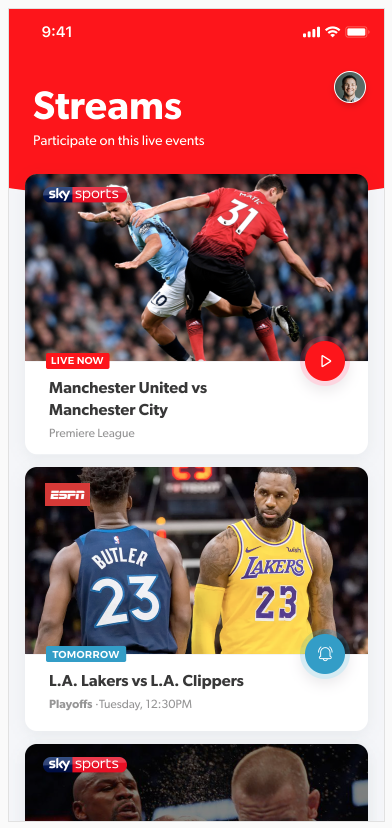
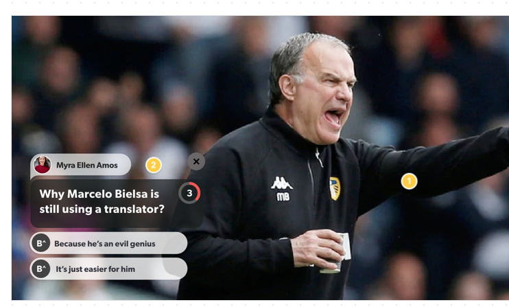

# Buff UP LTD Android Dev. Test

# The Task:

Create an Android Application using our Rest API to show a list of available Streams.

When you tap on the stream you should show a video player that plays the stream video.


## Part A: Android Application

Using the Rest API download the list of available streams and create a UI that looks like this:




Link to UI Mockup file (with downloadble assets): https://xd.adobe.com/view/402757c4-9f8a-4d87-79d0-9f69e5084889-3616/screen/d292c76d-948c-4b3a-b29b-7434e8650ab5/Stream-List-1-

When a user taps on an item, you should display the video player and play the video stream

## Part B: Android SDK

We now want an SDK that the Android App Uses to display content (Buff's as we call them) over the existing video.

The host Android Application should use the SDK to simply show content over the existing video.

The SDK should expose a view that the host Application is adding over the video frame that displays the Buff content there

### SDK Requirements

The SDK should have the following features

- Expose a function to retrieve the list of available Streams to the host App
- Expose a view that the host App will add in the UI over the video stream to display the Buffs
- Handle all the business and UI logic to display the Buffs over the video in the view

### Buff UI

The Buff UI should look like this:




The UI has 3 sections:

- Top Section that displays the Questions Sender Name and Image
- Middle section where we see the question and the countdown timer
- Bottom Section where we see the answers

**The countdown timer should work and at the end if the user hasn't yet voted, the question should automatically hide**

**The number of answers can vary from 2 to 5, your UI should automatically adapt to the number of answers that the API delivers**

**If the user selects an answer, the timer should stop and you should hide the Buff after 2 seconds**


### A sample video of the Buffs showing on the current iOS version can be seen here:

<video src="Buff.mov"></video>

## What we are looking for:

- An android application written in Kotlin and an accompanying SDK writen in Kotlin 
- Demonstration of coding style and design patterns.
- Knowledge of common android libraries and any others that you find useful.
- Error handling.
- Any form of unit or integration testing you see fit.
- The application must run on Android 5.0 and above.
- The application must compile and run in Android Studio.

## How to Submit your solution:

- Clone this repository
- Create a public repo in github, bitbucket or a suitable alternative and provide a link to the repository.
- Provide a readme in markdown which details your code and any libraries that you may have used.

## API Usage

This a brief summary of the api endpoints you will need in order to create the App and the SDK. There a lot of other additional properties from the json responses that are not relevant, but you must use these endpoints to retrieve the information needed for this task.

#### Base URL

The base URL for the staging environment is `https://buffup.proxy.beeceptor.com`. 

#### List of Streams

Provides a list of available Streams

```
GET /streams
```

#### Get  Buff

Gets the data for the Buff to show

```
GET /buffs/:buffId

Buff Id is the id of the buff to fetch
In the sample Rest API Buffs with Id's 1 to 5 are available
```

Sample response:

```
{
    "result": {
        "id": 155,
        "client_id": 1,
        "stream_id": 1,
        "time_to_show": 10,
        "priority": 3,
        "created_at": "2020-01-31T22:19:43.180391Z",
        "author": {
            "first_name": "Pedro",
            "last_name": "Luz"
        },
        "question": {
            "id": 155,
            "title": "Ball Circle Personal Loan Account impactful",
            "category": 1
        },
        "answers": [
            {
                "id": 387,
                "buff_id": 0,
                "title": "324324"
            },
            {
                "id": 388,
                "buff_id": 0,
                "title": "wqewqewq"
            }
        ],
        "language": "en"
    }
}
```

Using the above URL's to fetch the various Buffs, request the Buffs every 30 seconds (from 1 to 5) and display them over the video stream.

The Buff should be displayed with a countdown timer matching the time in the `time_to_show` field of each Buff.
If the user votes before the end of the timer (taps on an answer), you should freeze the timer and hide the Buff after 2 seconds.

If the timer expires and the user doesn't vote, you should hide the Buff.

If the user manually closes the Buff by tapping on the top right `x` close button, you should hide the Buff.


Good luck!
